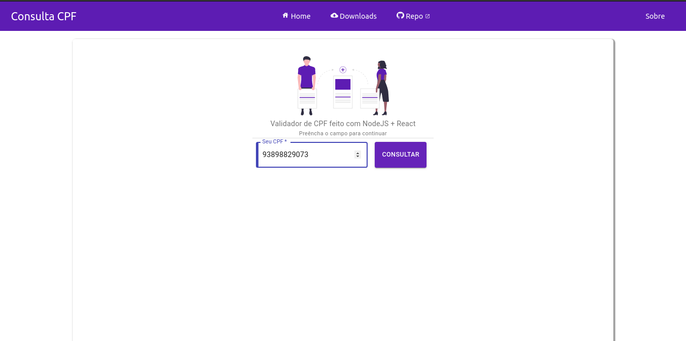
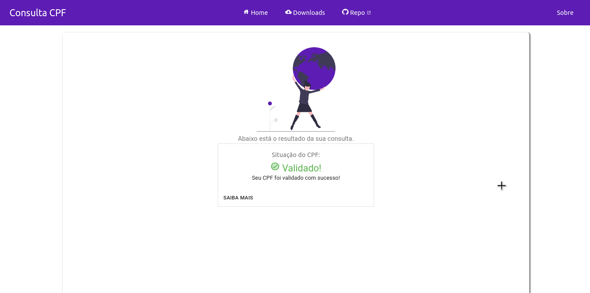
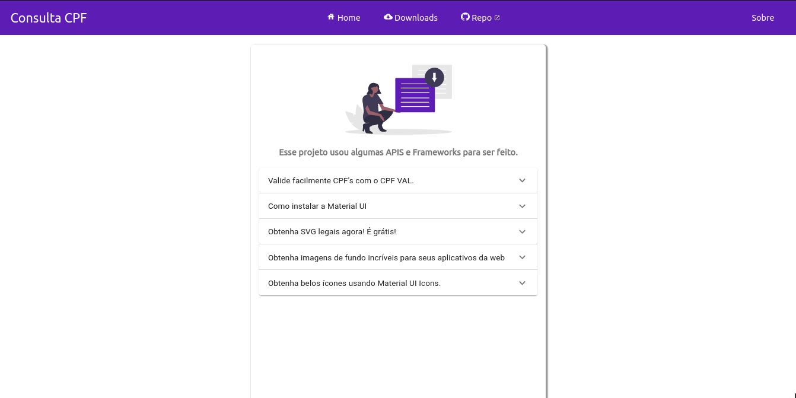

## [Demo](https://cpf-validation.now.sh/consulta.html&ref=home)

# CPF validation with CPF VAL and ReactJS

## Screenshots:







## Useful links:

> [CPF Generator](https://www.4devs.com.br/gerador_de_cpf)

> [CPF Val](https://www.npmjs.com/package/cpf-val)

## Examples

### `handleSubmit` example

```js
const handleSubmit = (evt, input, bad, sucess) => {
  evt.preventDefault();

  input = myCpf;

  bad = routes_consulta.bad;
  sucess = routes_consulta.sucess;

  if (cpf(input) === true) {
    window.location.href = sucess;
  } else {
    window.location.href = bad;
  }
};
```

### `<form>` example

```jsx
<form className={classes.root} onSubmit={handleSubmit}>
  <ValidationTextField
    className={classes.margin}
    label="Seu CPF"
    required
    variant="outlined"
    value={myCpf}
    onChange={(e) => setName(e.target.value)}
    defaultValue={null}
    placeholder="000.000.000.00"
    type="number"
    id="entrada_cpf"
  />

  <ColorButton
    variant="contained"
    color="primary"
    type="submit"
    value="Submit"
    className={classes.margin}
  >
    Consultar
  </ColorButton>
</form>
```

I left the `/build` folder for those who want to test the project working. Just this folder and enter `index.html` or test the project with the command `npm serves`.

If you want to test this project, you need a NodeJ development environment.

## Download NodeJS

In this project, the **LTS version 12.16.3** of _NodeJS_ was used. And the latest version of the Node package manager, _NPM_, was used.

> To download NodeJS go to [nodejs.org/en](https://nodejs.org/en/).

> To download the NPM go to [npmjs.com/get-npm](https://www.npmjs.com/get-npm)

After downloading and installing Node and NPM, fork this project and open it in the folder `/challenge01-hebert-f-barros/cpf-validator /`.

## Download the dependencies

Now open your terminal or prompt and install the dependencies.

```sh
npm install
```

## Test locally

To run the project in your development environment just run one of the commands below and wait for the browser to open automatically:

```sh
./serve.sh
```

or

```sh
npm start
```

## Compile the project

To compile the project just run the shell script file that I created or run the npm command directly:

```sh
./build.sh
```

or

```sh
npm run build
```
